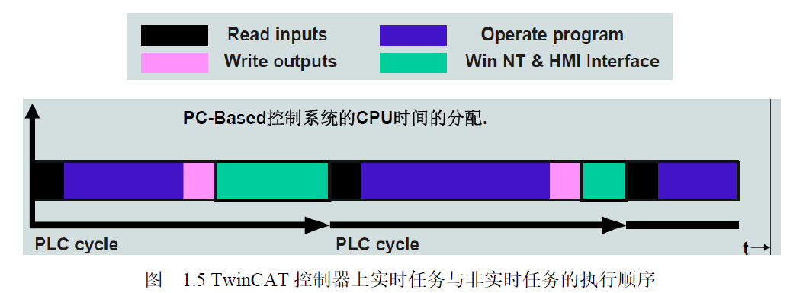

# Twincat
## Real time 

>实时核首先把计算机的CPU时间划分成 Time Base规定的小片断 1ms 在每个 ms优先执行 TwinCAT实时任务 ——依次执行 Read Input、 Operate Program和Write Output——然后再响应 Win NT & HMI Interface的其它请求。如果 CPU Limit限时到而 TwinCAT实时任务未执行完，则 TwinCAT线程挂起， CPU转去执行 Win NT & HMI Interface。
>
就是说，所有任务都只能在单核上工作，同时把线程时间分成小段，根据limit分配给twincat，优先级最高。

>TcCOM Module实例化为 Object Object由 Task调用， Task设置周期并指定到 Core。图上没有表达的是， Core需要指定 Base Time和 CPU Limit，而 Task的周期必须
是 Base Time的整数倍。

## 实用技巧
F2帮助可以智能补全一些东西