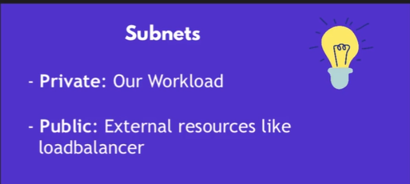

# 基础概念

- root用户：拥有AWS账户的完全访问权限，可以访问所有资源 和Linux一样
- IAM用户：拥有AWS账户的部分访问权限，可以访问指定资源，由root用户创建,在创建时会有一个访问密钥，用于通过AWS CLI访问AWS资源，在创建完成后有唯一一次机会下载这个密钥，csv格式，如果丢了，只能删除重新创建。
- VPC：Virtual Private Cloud，虚拟私有云，云端实体机，EC2实例，数据库等资源都在VPC中
- 子网：subnet，根据VPC的防火墙配置，子网根据访问性质划分，公有子网和私有子网
 
  - 子网掩码： 举例172.31.15.0/20，20表示前20位是网络地址，后12位是主机地址 ， 从这里可以简单计算 11111111 11111111 00001111 00000000 = 172.31.15.0 前20位锁死，后12位可以变化，所以可分配的IP地址是2^12-2=4094个，也就是范围从 172.31.0.1 - 172.31.15.254，其中0和255分别是网络地址和广播地址，不可分配。
  - 路由表和网关 ： 每个子网有一个路由表，路由表中有一个默认路由，指向一个网关，这个网关可以是一个NAT网关，也可以是一个Internet网关，NAT网关用于私有子网访问外网，Internet网关用于公有子网访问外网。 路由表的作用是根据目的地址决定下一跳地址，像地图一样，如果目的地址是外网，那么下一跳地址就是Internet网关，如果目的地址是内网，那么下一跳地址就是NAT网关。
  - PrivateDNS：AWS内部的DNS服务，可以通过PrivateDNS访问VPC内的资源，比如EC2实例，RDS数据库等。如果想要通过PrivateDNS访问资源，这要求所有请求来自VPC内部。

## AWS CLI

- 安装参考官网
- 配置
 `aws configure`
  - 输入access key ID
  - 输入secret access key
  - 输入region
  - 输入output format
  
 以上信息都在创建IAM用户时生成
 如果只想使用“临时”的某个用户可以通过设置环境变量来实现
  `export AWS_ACCESS_KEY_ID=xxxx`
  `export AWS_SECRET_ACCESS_KEY=xxxx`

- 简单语法
  - `aws services  command-name --option-name value`
    - filters : 筛选符合特征的资源
      - `--filters "Name=tag:Name,Values=MyInstance"`
      - Name和Values是固定的，tag:Name是筛选的特征，MyInstance是特征的值
    - query ： 筛选特定的信息，只显示这些信息
      - `--query "Reservations[*].Instances[*].[InstanceId,InstanceType,State.Name,Tags[?Key=='Name'].Value]"`
  
### 设置安全组

  安全组本质上是一个虚拟防火墙，控制入站和出站流量，可以通过CLI或者控制台设置。

  `aws ec2 authorize-security-group-ingress --group-id sg-0a8288ea515970965 --protocol tcp --port 22 --cidr 37.4.228.119/32`

- 入站规则-ingress，允许外部IP访问VPC的资源。
- 出站规则-egress，允许VPC的资源访问外部IP，比如install，pull一些docker images等。

### 创建key-pair

   `aws ec2 create-key-pair --key-name MyKeyPair --output text > MyKeyPair.pem`

- aws ec2 run-instances
 --image-id ami-0346fd83e3383dcb4
 --count 1
 --instance-type t2.micro
 --key-name MyKPCli
 --security-group-ids sg-0a8288ea515970965
 --subnet-id subnet-03b57da1373d0191b

### 创建策略

``` json
{
    "Version": "2012-10-17",
    "Statement": [
        {
            "Effect": "Allow",
            "Action": ["iam:ChangePassword"]
            ,
            "Resource": ["arn:aws:iam::381492097429:user/${aws:username}"]
        },
        {
            "Effect": "Allow",
            "Action": ["iam:GetAccountPasswordPolicy"],
            "Resource": "*"
        }
    ]
}
```

`aws iam create-policy --policy-name changePwd --policy-document file://aws-changeword-policy.json`

## AWS容器服务

AWS有三个常用的容器相关的服务，分别是ECR,ECS和EKS。
其中ECR是容器镜像仓库，

ECS是是AWS自家的容器服务

EKS是Kubernetes服务。可以让用户不用自己搭建Kubernetes集群，直接使用AWS的Kubernetes服务。

一般来说EKS会好一些，因为k8s是开源的，有很多社区的支持，日后迁移也比较方便，而ECS是AWS自家的服务，插件相对来说会少一些。ECS的优点是简单，使用起来比较方便，而且和AWS的其他服务集成的比较好。

### EKS

使用EKS我们需要创建EKS cluster，这个集群是由master（control panel）和work node组成的，master是AWS托管的，work node是我们自己创建的，我们在work node上部署我们的应用。

或者我们使用Fargate部署应用，Fargate是AWS的serverless容器服务，我们不需要关心work node，即配置，autoscaling等，只需要部署我们的应用就可以了。也就是把worknode这块也托管了，灵活度低但是易用性高。

使用aws链接EKS集群需要命令行工具kubectl，kubectl是Kubernetes的命令行工具，可以用来和Kubernetes集群交互。如果kubectl，aws cli，安装好了，并且身份验证(aws-iam-authenticator)也配置好了，那么我们就可以使用命令`aws eks --region your-region update-kubeconfig --name my-cluster`来连接到EKS集群。

## boto3

boto3是AWS的python SDK，可以用来和AWS的服务交互，比如创建EC2实例，创建S3 bucket等。

### 监测EC2实例

``` python
import boto3

ec2 = boto3.client('ec2')
instances = ec2.describe_instances() 
for instance in instances['Reservations']:
    for instance in instance['Instances']:
        print(instance['InstanceId'])
```

如果有多个instance，可以在`describe_instances()`中加入`Filters`参数来筛选特定的instance。

``` python

import boto3

ec2 = boto3.client('ec2')
instances = ec2.describe_instances(
    Filters=[
        {
            'Name': 'instance-state-name',
            'Values': ['running']
        }
    ]
) 
.....

```
