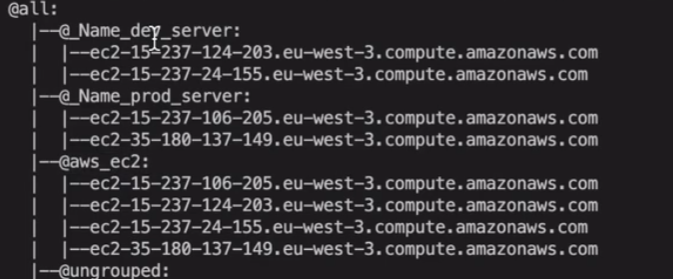
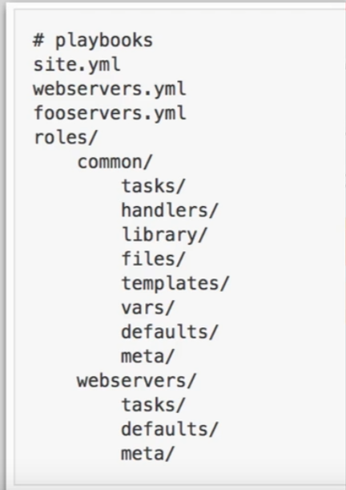

# Ansible

Ansible是一个自动化运维工具，它可以用来配置服务器、部署应用、管理系统等。Ansible的核心是一个基于Python的SSH协议的轻量级的配置管理工具，它不需要在被管理的服务器上安装客户端，只需要在控制端安装即可。 Ansible的配置文件是YAML格式。

个人感受：ansible写配置文件很方便，简洁清晰，因为用ssh协议通讯，也可以说是换一种方式敲Linux命令。 并且也是因为ssh所以只要配置好了credentials，可以在任何地方运行。但是一般在实际运用中会给Ansible独立一个服务器，然后在这个服务器上配置好credentials，然后在这个服务器上运行playbook。

## 安装

```bash
sudo apt-get install ansible
```

## Ansible配置

对于ansible如何连接到远程服务器，可以配置目录下的hosts文件。这个文件可以包含多个组，每个组包含多个主机。比如：

```ini

[web]
1.1.1.1 

[web:vars]
ansible_user=ubuntu #这些都是保留字
ansible_ssh_private_key_file=~/.ssh/id_rsa

[db]
1.1.1.2

[db:vars]
ansible_user=ubuntu
ansible_ssh_private_key_file=~/.ssh/id_rsa
```

也可以都在一行上，就是有点乱。

同时也可以配置ansible.cfg文件，这个文件默认全局配置位于`/etc/ansible/ansible.cfg`，ansible运行时会先检查ansible命令的目录中是否有ansible.cfg文件，如果不存在该文件，则检查用户的主目录（~/.）中是否有ansible.cfg文件，在找不到其他配置文件时，使用全局/etc/ansible/ansible.cfg文件（似乎已弃用），如果都不存在，ansible包含它使用的默认值。

```ini
[defaults]
host_key_checking = False
inventory = /path/to/hosts
```

对于大部分命令，ansible会默认在host上执行，但是有些命令需要在本地执行，比如copy。

如何联动terraform和ansible，可以在terraform中使用`local-exec`来执行ansible-playbook命令，参见Terraform笔记。

## Playbook

Playbook是Ansible的配置文件，是一个YAML格式的文件，用来定义一组任务。一个Playbook可以包含多个任务，每个任务可以包含多个模块。比如：

```yaml
---
-name: example 
  hosts: web
  remote_user: ubuntu
  tasks:
    - name: install apache2
      apt: name=apache2  #这里是模块，注意apt和state两句我用了两种写法，都是可以的
      state: present
    - name: start apache2
      service: name=apache2
      state: started
```

### Module and Plugins and Collections

值得注意的是，在最新版本的Ansible中，Ansible使用了新的结构，引入了collections的概念，collections是一组模块、插件、角色、剧本和库的集合，可以通过ansible-galaxy命令下载。
也可以自己创造自己的collections，然后在playbook中引用。

对于一些模块可能需要安装python依赖，比如docker。可以使用`pip install docker`来安装。
对于一些服务器没有python3的情况，可以使用`ansible_python_interpreter`来指定python解释器，比如：

```yaml
---
- name: example
  hosts: web
  vars:
    ansible_python_interpreter: /usr/bin/python #这里是指定python2
  tasks:
    - name: install python3
      yum:
        name: python3
```

但是这种情况可能有一个隐患，就是在所有任务执行之前会有个gather_facts的任务，这个任务会使用python3，所以如果服务器没有python3，会导致这个任务失败，所以可以在playbook中关闭这个任务，比如：

```yaml
---
- name: example
  hosts: web
  gather_facts: no
  vars:
    ansible_python_interpreter: /usr/bin/python
  tasks:
    - name: install python3
      yum:
        name: python3
```

collections的目录结构如下,其中galaxy.yml是必须的：

  

- Ansible有`shell`和`command`两个build-in模块，用来执行命令,因为是build-in模块所以可以不指定全名。`command`模块更安全。但是要注意这两种模块都不会有state management,不会检查服务器当前状态，所以在重复执行playbook时，会比如多次创建服务文件等。但是可以使用`when`模块来检查状态，比如：

```yaml
---
- name: example
  hosts: web
  tasks:
    - name: check apache2
      command: systemctl status apache2
      register: result
    - name: start apache2
      command: systemctl start apache2
      when: result.stdout.find('active') == -1
```
  
- 想要控制台的输出，我们需要`register`模块和`debug`模块，比如：

```yaml
---
-name: example 
hosts: web
tasks:
    - name: check apache2
    command: systemctl status apache2
    register: result
    - name: print result
    debug: msg={{result}} #使用双大括号引用变量，double curly braces
```

### 变量

- 根据语法有时候我们必须使用括号把变量的大括号括起来，比如：

```yaml

---
- name: example
  hosts: web
  vars:
    - item: /etc/hosts 
  tasks:
    - name: copy some file
      src: "{{ item }}" #使用双大括号引用变量,同时使用双引号引用变量，这是为了区分yaml的语法（字典）和ansible的语法（变量）
      dest: /tmp/
```

传递变量还可以使用`extra-vars`参数，比如：

```bash
ansible-playbook playbook.yml --extra-vars "item=foo"
```

注意：这样做可以不用在playbook中的`vars`里定义变量。

显而易见的我们也可以创建一个变量文件，然后在playbook中引用，比如：

```yaml
# vars.yml
items： /etc/hosts
```

然后在playbook中引用，注意每个section都要有vars_files,并不是全局的（待验证）：

```yaml
---
- name: example
  hosts: web
  vars_files:
    - vars.yml
  tasks:
    - name: copy some file
      src: "{{ item }}"
      dest: /tmp/
```

对于要在执行的Linux命令中要使用另一个命令的结果，可以使用`register`模块，或者使用lookup模块，比如：

```yaml
---
- name: example
  hosts: web
  tasks:
    - name: get system architecture
      command: echo {{lookup('pipe', 'uname -m')}}
```

可以使用`become`模块来更改执行的用户，比如：

```yaml
---
- name: example
  hosts: web
  become: yes
  become_user: root #如果是root可省略，可是其他用户
  tasks:
    - name: install apache2
      apt: name=apache2
      state: present
```

安装包的时候一般都需要提权，所以可以直接在playbook中加上`become: yes`，默认就是root用户。

对于一些用户用户组权限操作，需要重启生效，可以使用meta模块，比如：

```yaml
---
- name: example
  hosts: web
  tasks:
    - name: add user
      user: name=foo
      state: present
    - name: add user to group
      user: name=foo
      groups=bar
    - name: restart
      meta: reset_connection
```

## 连接

Ansible通常是在infrastructure建立后配置，这个pipeline前半部分一般由terraform完成，而创建完成后instance的可用可能要等一段时间生效，所以可以使用`wait_for`模块来等待，比如：

```yaml
---
- name: Wait for connection
  hosts: web
  gather_facts: no
  tasks:
    - name: wait for ssh
      wait_for: port=22 delay=10 timeout=300 search_regex=OpenSSH #等待22端口打开，每10秒检查一次，最多等300秒
      host: '{{ (ansible_ssh_host | default(inventory_hostname)| default(ansible_host)) }}'
      vars:
        ansible_connection: local #指定这些命令是在本地执行，而不是去远程服务器执行
        ansible_python_interpreter: /usr/bin/python
```

### 动态inventory

有两个实现方式，一个是使用plugin (YAML),一个是script (Python)，用来动态获取aws下的所有可用instance。

启用plugin需要在ansible.cfg中配置，比如：

```ini
[defaults]
enable_plugins = host_list, script, aws_ec2, auto, yaml, ini, toml
```

以aws_ec2为例我们需要创建一个inventory文件，名字必须包含aws_ec2，比如：

```yaml
# inventory_aws_ec2.yml

plugin: aws_ec2
regions:
  - your-region
filters: # 可以通过tagname 或者其他的东西比如id来筛选
  tag:Name: your/regrex 
  instance-state-name: running
keyed_groups: # 可以通过key指定的aws_instance属性来分组
  - key: tags
    prefix: your-prefix # 可以在输出中的group前加上前缀

```

运行这个inventory文件：`ansible-inventory -i inventory_aws_ec2.yml --graph`
输出的结果如下：


然后在cfg文件中配置好aws的credentials和在playbook模块中指定hosts为plugin中返回的名字即可。
然后运行命令：`ansible-playbook -i inventory_aws_ec2.yml playbook.yml` (也可以在playbook中指定hosts为`inventory_aws_ec2.yml`，这样就不用在命令行中指定了。)

## Roles

Roles是Ansible的一种组织方式，可以把一组任务组织在一起，类比k8s的helm, terraform的module，使用的动机和场景就是对配置文件的复用。当然社区如Ansible-Galaxy和Git也有很多现成的roles可以直接使用。

Roles的目录结构如下：



- common: 自定义名称，爱叫什么叫什么
- tasks: 名称自定义，但必须包含main.yml文件
- handlers（optional）: 包含所有的handlers
- files（optional）: 包含所有的文件
- templates（optional）: 包含所有的模板
- vars（optional）: 包含所有的变量,优先级低于命令行
- defaults（optional）: 包含所有的默认变量，优先级低于vars
- library（optional）: 包含所有的自定义模块,python文件