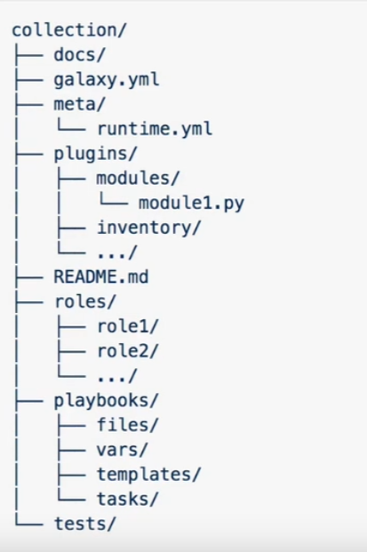

# Ansible

Ansible是一个自动化运维工具，它可以用来配置服务器、部署应用、管理系统等。Ansible的核心是一个基于Python的SSH协议的轻量级的配置管理工具，它不需要在被管理的服务器上安装客户端，只需要在控制端安装即可。 Ansible的配置文件是YAML格式的，易于阅读和编写。

个人感受：ansible写配置文件很方便，简洁清晰，因为用ssh协议通讯，也可以说是换一种方式敲Linux命令。 并且也是因为ssh所以只要配置好了credentials，可以在任何地方运行。

## 安装

```bash
sudo apt-get install ansible
```

## 配置

对于ansible如何连接到远程服务器，可以配置目录下的hosts文件。这个文件可以包含多个组，每个组包含多个主机。比如：

```ini

[web]
1.1.1.1 

[web:vars]
ansible_user=ubuntu #这些都是保留字
ansible_ssh_private_key_file=~/.ssh/id_rsa

[db]
1.1.1.2

[db:vars]
ansible_user=ubuntu
ansible_ssh_private_key_file=~/.ssh/id_rsa
```

也可以都在一行上，就是有点乱。

同时也可以配置ansible.cfg文件，这个文件默认全局配置位于`/etc/ansible/ansible.cfg`，ansible运行时会先检查ansible命令的目录中是否有ansible.cfg文件，如果不存在该文件，则检查用户的主目录（~/.）中是否有ansible.cfg文件，在找不到其他配置文件时，使用全局/etc/ansible/ansible.cfg文件（似乎已弃用），如果都不存在，ansible包含它使用的默认值。

```ini
[defaults]
host_key_checking = False
inventory = /path/to/hosts
```

对于大部分命令，ansible会默认在host上执行，但是有些命令需要在本地执行，比如copy。

## Playbook

Playbook是Ansible的配置文件，是一个YAML格式的文件，用来定义一组任务。一个Playbook可以包含多个任务，每个任务可以包含多个模块。比如：

```yaml
---
-name: example 
  hosts: web
  remote_user: ubuntu
  tasks:
    - name: install apache2
      apt: name=apache2  #这里是模块，注意apt和state两句我用了两种写法，都是可以的
      state: present
    - name: start apache2
      service: name=apache2
      state: started
```

### Module and Plugins and Collections

值得注意的是，在最新版本的Ansible中，Ansible使用了新的结构，引入了collections的概念，collections是一组模块、插件、角色、剧本和库的集合，可以通过ansible-galaxy命令下载。
也可以自己创造自己的collections，然后在playbook中引用。

对于一些模块可能需要安装python依赖，比如docker。可以使用`pip install docker`来安装。

collections的目录结构如下,其中galaxy.yml是必须的：



- Ansible有`shell`和`command`两个build-in模块，用来执行命令,因为是build-in模块所以可以不指定全名。`command`模块更安全。但是要注意这两种模块都不会有state management,不会检查服务器当前状态，所以在重复执行playbook时，会比如多次创建服务文件等。但是可以使用`when`模块来检查状态，比如：

```yaml
---
- name: example
  hosts: web
  tasks:
    - name: check apache2
      command: systemctl status apache2
      register: result
    - name: start apache2
      command: systemctl start apache2
      when: result.stdout.find('active') == -1
```
  
- 想要控制台的输出，我们需要`register`模块和`debug`模块，比如：

```yaml
---
-name: example 
hosts: web
tasks:
    - name: check apache2
    command: systemctl status apache2
    register: result
    - name: print result
    debug: msg={{result}} #使用双大括号引用变量，double curly braces
```

### 变量

- 有时候我们必须使用括号把变量的大括号括起来，比如：

```yaml

---
- name: example
  hosts: web
  vars:
    - item: /etc/hosts 
  tasks:
    - name: copy some file
      src: "{{ item }}" #使用双大括号引用变量,同时使用双引号引用变量，这是为了区分yaml的语法（字典）和ansible的语法（变量）
      dest: /tmp/
```

传递变量还可以使用`extra-vars`参数，比如：

```bash
ansible-playbook playbook.yml --extra-vars "item=foo"
```

注意：这样做可以不用在playbook中的`vars`里定义变量。

显而易见的我们也可以创建一个变量文件，然后在playbook中引用，比如：

```yaml
# vars.yml
items： /etc/hosts
```

然后在playbook中引用，注意每个section都要有vars_files,并不是全局的（待验证）：

```yaml
---
- name: example
  hosts: web
  vars_files:
    - vars.yml
  tasks:
    - name: copy some file
      src: "{{ item }}"
      dest: /tmp/
```

对于要在执行的Linux命令中要使用另一个命令的结果，可以使用`register`模块，或者使用lookup模块，比如：

```yaml
---
- name: example
  hosts: web
  tasks:
    - name: get system architecture
      command: echo {{lookup('pipe', 'uname -m')}}
```

可以使用`become`模块来更改执行的用户，比如：

```yaml
---
- name: example
  hosts: web
  become: yes
  become_user: root #如果是root可省略，可是其他用户
  tasks:
    - name: install apache2
      apt: name=apache2
      state: present
```

安装包的时候一般都需要提权，所以可以直接在playbook中加上`become: yes`，默认就是root用户。

对于一些用户用户组权限操作，需要重启生效，可以使用meta模块，比如：

```yaml
---
- name: example
  hosts: web
  tasks:
    - name: add user
      user: name=foo
      state: present
    - name: add user to group
      user: name=foo
      groups=bar
    - name: restart
      meta: reset_connection
```
