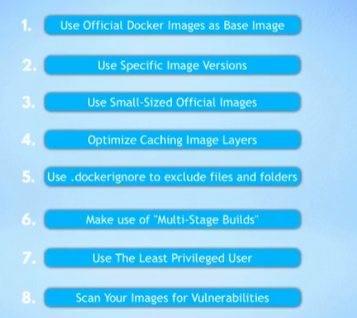

# 概念

## Best Practice

FROM nana



## 与虚拟机的不同

一般来说计算机系统可以分为两个部分

1. 应用层
2. 核心层（与硬件通讯）
docker是虚拟了应用层，没有自己的OS kernel。而虚拟机是虚拟化了一整个操作系统，包括了核心层。所以这也解释了docker的image是分操作系统的，一般来说在Linux build的 image不适用于在windows上，因为Linux 的application layer无法调用Windows 的os kernel。
但是！Docker desktop 却支持在windows上运行Linux image，其实是因为内部集成了一个轻量级的Linux的发行版，导致了可以让linux 的image可以在windows电脑上运行。

## 安装Docker Desktop到底安装了什么

1. Docker Engine
   核心，server，管理容器和image
2. Docker CLI-Client
   命令行interface，可以和docker server交互
3. GUI Client
   图像化界面与docker server交互
4. Compose
    用于定义和运行多个container的工具
    - 如果是Linux，需要单独安装，安装参考：https://docs.docker.com/compose/install/

## Docker images是什么，和container有什么关系

1. images是一种可运行的应用artifact，一种集合就像zip文件一样打包了所有需要的东西，比如完整的环境配置信息，任何需要的服务
2. Container是一个运行image实例的地方，可以一个image在不同容器中同时运行
3. Docker Hub 是推荐的docker Registries 可以下载官方或者个人开发者开发的image，同时也是Docker Desktop的默认下载位置

## 常见命令

- 登录：docker login -u username -p password
 - 默认是docker hub ， 如果是其他的registries，可以在最后添加`registry_url`docker login registry_url
- 构建：docker build -t repo_name .
 - 推送的时候需要tag repo_name ，这个tag也正好指向了要推给哪个repository，例如：docker -t repo_url/repo_name:tag, 如果image_name 不是 repo_url/repo_name:tag的形式，那么推送会失败

- 推送：docker push repo_name
- 拉取：docker pull repo_name
- 运行：docker run repo_name
- 拷贝：docker cp /host/path/to/file container_id:/path/to/file  # 从host拷贝到container

## 数据库

### 常见数据库类型

1. 关系型数据库 relational database

  - 优点
    1. 数据一致性
    2. 数据完整性
    3. 数据安全性
  - 缺点
    1. 读写性能差
    2. 扩展性差
    3. 一致性维护困难
  - 例子
    1. MySQL
    2. PostgreSQL
   
2.  键值对数据库 key-value database

    - 优点
      1. 读写性能好
      2. 扩展性好
    - 缺点
      1. 数据一致性差
      2. 数据完整性差
    - 例子
      1. Redis
      2. Memcached
3. 列存储数据库 column-oriented database
    - 优点
      1. 读写性能好
      2. 扩展性好
    - 缺点
      1. 数据一致性差
      2. 数据完整性差
    - 例子
      1. HBase
      2. Cassandra
4. 文档型数据库 document-oriented database
    - 优点
      1. 读写性能好
      2. 扩展性好
    - 缺点
      1. 数据一致性差
      2. 数据完整性差
    - 例子
      1. MongoDB
      2. CouchDB
5.  图数据库 graph database
    - 优点
      1. 读写性能好
      2. 扩展性好
    - 缺点
      1. 数据一致性差
      2. 数据完整性差
    - 例子
      1. Neo4j
      2. ArangoDB
6.  搜索数据库 search database
    - 优点
      1. 读写性能好
      2. 扩展性好
    - 缺点
      1. 数据一致性差
      2. 数据完整性差
    - 例子
      1. ElasticSearch
      2. Solr

## volume

volume是一个目录或者文件，可以在container和host之间共享数据

有三种类型的volume：

1. host volume
2. anonymous volume
3. named volume （最常用）
docker desktop中可以在setting中设置volume的位置，但是他妈的这是host volume，所以它没法通过 name reference来引用，只能通过绝对路径来引用，如果想把它变成named volume，可以通过docker volume create命令来创建一个named volume，然后在一个container挂载两个volume，一个是host volume，一个是named volume,然后把host volume的数据copy到named volume中，然后删除host volume，这样就可以通过name reference来引用了。

代码:

``` shell
docker volume create my-vol

docker run --rm -v /path/to/host/volume:/source -v my-vol:/dest busybox sh -c "cd /source && tar cf - . | (cd /dest && tar xvf -)"

```

## docker in docker /在docker container中运行docker command

   在docker中执行docker命令, 只是调用了顶层host的server

   重要：需要在docker中先安装docker CLI 然后通过docker.sock来和docker daemon通信

   ``` bash
   curl https://get.docker.com/ > dockerinstall && chmod 777 dockerinstall && ./dockerinstall
   ```

  然后在启动docker container的时候

  ``` shell 
  -v /var/run/docker.sock:/var/run/docker.sock来实现

  ```

  最后记得修改docker.sock的权限

  ``` shell
  chmod 777 /var/run/docker.sock
  ```

  注意： 重启container的时候，docker.sock的权限会被重置，所以需要在启动container的时候要复用之前的权限设置

  ## 如何升级docker内的软件，在不build新的image的情况下

  ### Jenkins

- 以root用户登录到jenkins container `$ docker exec -u 0 -it ${dockercontainer ID} /bin/bash`
- 下载jenkins war包 `$ wget http://updates.jenkins-ci.org/download/war/2.235.1/jenkins.war`
- 移动到jenkins目录 `$ mv jenkins.war /usr/share/jenkins/jenkins.war`
- 修改权限 `$ chown jenkins:jenkins /usr/share/jenkins/jenkins.war`
- 重启container `$ docker restart ${dockercontainer ID}`

