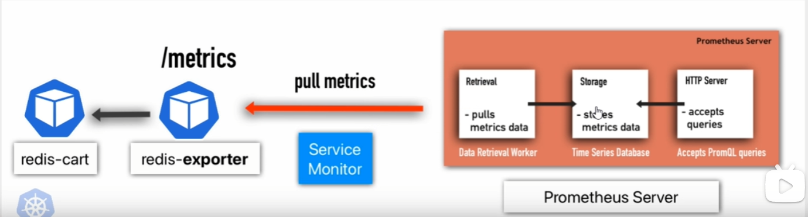

# 简介

Prometheus是一个开源的系统监控和警报工具包。可以用来监测三个方面的数据, 并且可以得到通知

- Infrastructure metrics：CPU、Memory、Disk等
- Platform metrics：Kubernetes、Docker、Etcd等
- Application metrics：自定义的应用程序指标

一般搭配Kubernetes使用，并且Promehteus Operator可以简化Prometheus的部署和管理,拓展了Kubernetes的API，使得Prometheus可以通过CRD的方式来部署和管理Prometheus。CRD是Custom Resource Definition的缩写，即自定义资源定义。

所以安装Prometheus也一般通过Helms chart来安装，这样可以方便的管理Prometheus。

API 文档：
https://docs.openshift.com/container-platform/4.16/rest_api/monitoring_apis/alertmanagerconfig-monitoring-coreos-com-v1beta1.html

如何用Prometheus监控第三方应用程序，关键是exporter：

并且在自己编写的第三方程序中，代码层级的metric当然需要自己编写，具体到不同的编程语言可以参见不同的client库。 如Python的prometheus_client库。并且要配置好可以scraper的endpoint，默认是`/metrics`

同样使用rules时也不必重复造轮子，有一些网站提供了一些规则的模板，可以直接使用：
如 awesome-prometheus-alerts：https://awesome-prometheus-alerts.grep.to

监视时候也是一样，可以在grafana上直接导入一些模板: https://grafana.com/grafana/dashboards