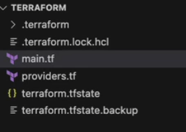
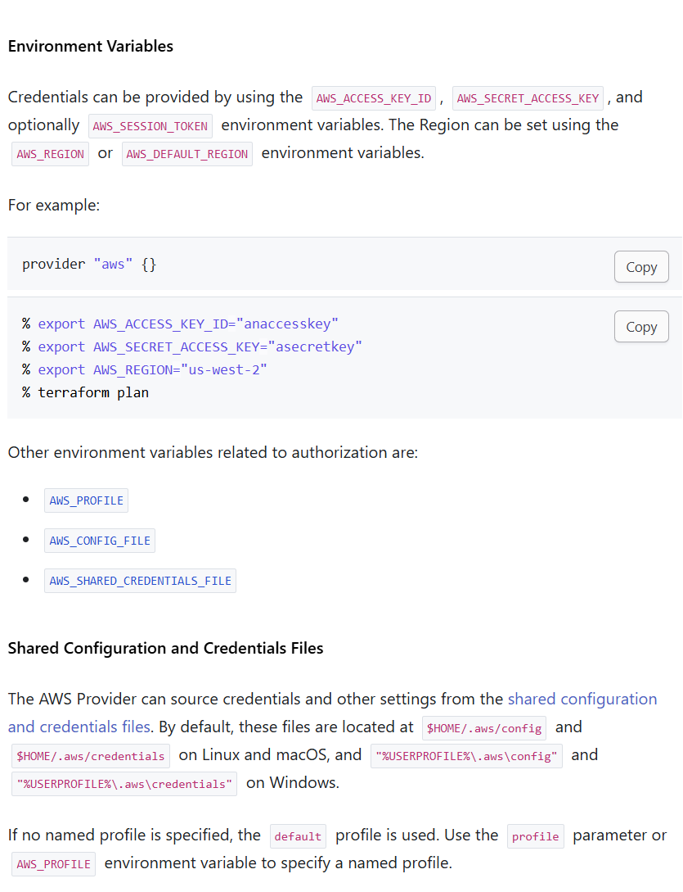

# Terraform

Terraform是一个基础设施即代码工具(Iac，Infrastructure as code)，它允许你定义基础设施的配置文件，然后使用这些配置文件来创建、更新和删除基础设施。

Terraform配置文件使用HCL（HashiCorp Configuration Language）编写，它是一种声明式的配置语言，这意味着你只需要定义你想要的基础设施，而不需要定义如何实现这些基础设施。

一个很好的例子是，你创建了一个服务器在AWS上，甚至启动了一个服务（比如通过user_data），但是后续的debug和维护就不（应该）是terraform的事情了，terraform只负责创建和删除资源。

## 目录结构

Terraform 有`.tf`文件和`.tfstate`文件。`.tf`文件是配置文件，`.tfstate`文件是状态文件，用来记录当前基础设施的状态。

`tfstate`文件一般是本地储存，所以在团队协作时，需要使用远程存储，比如AWS S3，Google Cloud Storage等，这个定义在`backend`中。

```json
terraform {
  backend "s3" {
    bucket = "mybucket"
    key    = "path/to/my/key"
    region = "us-west-1"
  }
}
```

这样使用同一个`tfstate`文件，可以避免多人同时操作时的冲突。在本地执行`terraform init`和`terraform state list`时，会自动下载`tfstate`文件，但是多人同时操作时，可能会有冲突，所以在选择存储时最好选择有locking的存储，比如aws S3。

！！任何时候都不要手动修改`tfstate`文件！！

同时还有一个.lock.hcl文件，用来记录当前terraform的版本。
还有初始化后生成的.terraform文件夹，用来存放terraform的插件和缓存。



值得注意的是，对于aws，可能包括其他平台，使用terraform时验证时在背后自动执行的。所以需要配置好aws cli，或者使用环境变量。

## Syntax

HCL类似于JSON，但是更加人类可读。HCL的基本语法如下：

```json
resource "aws_vpc" "my_vpc" {
  cidr_block = "10..0.0.0/16"
  enable_dns_hostsnames = true
  tags = {
    Name = "my_vpc"
  }
}

resource "aws_instance" "example" {
  ami           = "ami-0c55b159cbfafe1f0"
  instance_type = "t2.micro"
  vpc_id        = aws_vpc.my_vpc.id
}
```

对于不同的平台，需要使用不同的provider，比如AWS，Azure等。在配置文件中，需要指定使用的provider, 同时也兼具身份验证的功能。

```json
provider "aws" {
  region = us-west-1
}
```

在初次使用时需要先初始化terraform，使用`terraform init`命令。

初始化完成后，可以使用`terraform plan`命令来预览terraform的执行计划，使用`terraform apply`命令来执行计划。
    - 在`apply`命令后加入`-auto-approve`参数，可以直接执行计划，不需要再次确认。

如果对一个terraform重复执行`terraform apply`命令，terraform会自动检测当前状态和配置文件的差异，然后生成一个执行计划（declarative）

创建资源使用`resource`关键字，资源的类型和名称之间使用空格分隔。资源的属性使用键值对的形式定义。
如果创建资源时需要引用上下文，可以直接使用resource的名称和属性名称.

如果需要查询，则使用`data`关键字,内部再使用filter来过滤数据。

```json
data "aws_ami" "example" {
  most_recent = true
  owners = ["amazon"]
  filter {
    name   = "name"
    values = ["amzn-ami-hvm-*"]
  }

  filter {
    name   = "virtualization-type"
    values = ["hvm"]
  }
}
```

如果要删除资源，有两种方式：

1. 使用`terraform destroy <resource name>`命令，删除指定的资源。如果不指定资源名称，则删除所有资源。
2. 修改tf文件，把原有的资源段删除，然后使用`terraform apply`命令，terraform会自动删除这个资源。(更推荐，因为tf更直观，他显示的就是应有的状态)

如果要查看资源的状态，可以使用`terraform state show`命令。

如果要输出资源的属性，可以在tf中使用`output`关键字。

```json
output "instance_ip" {
  value = aws_instance.example.public_ip
}
```

### Variables

为了避免硬编码，可以使用变量。变量可以在tf文件中定义，也可以在命令行中传入，或者在`terraform.tfvars`文件中定义，后两种如果有定义，会覆盖tf文件中的定义。

```json
variable "region" {
  type    = string # 也可以是list, 比如list的话，在引用时可以使用[index] 类似python
  default = "us-west-1" # 如果没有，则会在命令行中要求输入
  description = "The region in which to launch the instance"
}

resource "aws_instance" "example" {
  ami           = "ami-0c55b159cbfafe1f0"
  instance_type = "t2.micro"
  region        = var.region
}
```

命令行方式：

```bash
terraform apply -var="region=us-west-1"
```

`terraform.tfvars`文件方式：

```json
#同级目录下 terraform.tfvars
region = "us-west-1"
```

如果为了区分不同变量用了多个tfvars文件，不是默认的`terraform.tfvars`，可以使用`-var-file`参数指定文件。

```bash
terraform apply -var-file="prod.tfvars"
```

同样的，如果想在字符串中引用变量，可以使用`${var.<variable_name>}`的方式。

如果想在结构中添加文件，可以使用`file()`函数。

```json
variable "private_key_path" {
  type = string
  default = "~/.ssh/id_rsa"
}

resource "aws_key_pair" "example" {
  key_name   = "examplekey"
  public_key = file(var.private_key_path)
}
```

### Environment variables

可以使用环境变量来传递变量，具体环境变量名查阅官方文档。主要动机还是为了避免硬编码。

```bash
export TF_VAR_region=us-west-1
```

可是这是临时的。如果要永久的，可以在`~/.bashrc`或者`~/.bash_profile`中添加。
或者使用aws cli的profile，这样terraform会自动使用aws cli的profile。

具体举例：



同时 Terraform 也支持自定义环境变量 `TF_VAR_`，比如 `TF_VAR_myregion="us-east-1a`，这样就可以参考上一节的变量定义。

```json
variable "myregion" {
}

resource "aws_instance" "example" {
  ami           = "ami-0c55b159cbfafe1f0"
  instance_type = "t2.micro"
  region        = var.myregion
}
```

## Provisioner (一般不推荐使用)

Provisioner是用来在资源创建后执行一些操作的。比如在创建EC2实例后，执行一些命令，或者上传文件等。

Terraform支持多种provisioner，比如`local-exec`, `remote-exec`, `file`

```json
resource "aws_instance" "example" {
  ami           = "ami-0c55b159cbfafe1f0"
  instance_type = "t2.micro"

  provisioner "local-exec" {
    command = "echo ${aws_instance.example.public_ip} > ip_address.txt"
  } # 在本地执行命令，不是在创建的资源上
}
```

```json
resource "aws_instance" "example" {
  ami           = "ami-0c55b159cbfafe1f0"
  instance_type = "t2.micro"

  provisioner "remote-exec" {
    inline = [
      "sudo apt-get update",
      "sudo apt-get install -y nginx",
      "sudo systemctl start nginx"
    ]
  } # 在创建的资源上执行命令
}
```

```json
resource "aws_instance" "example" {
  ami           = "ami-0c55b159cbfafe1f0"
  instance_type = "t2.micro"

  provisioner "file" {
    source      = "script.sh"
    destination = "/tmp/script.sh"
  } # 上传文件
}
```

### Ansible

可以在terraform使用专业的configuration工具ansible

```json
resource "aws_instance" "example" {
  ami           = "ami-0c55b159cbfafe1f0"
  instance_type = "t2.micro"

provisioner "local-exec" {
  working_dir = "/path/to/folder/with/ansible/playbook"
  command =  "ansible-playbook --inventory ${self.public_ip}, --private-key ${var.private_key} --user ec2-user playbook.yml"

  #这样在ansible中host要指定为all才可以正确接收到self.public_ip
}
}
```

#### null_resource

如果想在创建资源后执行一些操作，但是不想在资源上执行，可以使用null_resource。

```json
resource "aws_instance" "example" {
  ami           = "ami-0c55b159cbfafe1f0"
  instance_type = "t2.micro"
}

resource "null_resource" "example" {
 triggers = {
    trigger = aws_instance.example.public_ip
  }

 provisioner "local-exec" {
  working_dir = "/path/to/folder/with/ansible/playbook"
  command =  "ansible-playbook --inventory ${aws_instance.example.public_ip}, --private-key ${var.private_key} --user ec2-user playbook.yml"

  # 注意这里的变量引用
}
```

## Modules

Modules是用来组织terraform配置文件的。可以把一些常用的配置文件组织成一个module，然后在其他配置文件中引用，类比helm的chart。应该有四个文件，main.tf, variables.tf, outputs.tf, providers.tf.

- variables.tf 在module中定义，同时也要在root中定义，因为要引用.
- source是module的路径，可以是相对路径(记得加 ./) ，也可以是git地址。
- output是module的输出，可以在root/其他module中通过module.module_name+output_name引用, 也是主要用法，把某些定义值暴露给root, 常见的scenario是module中定义了某些资源，root预先不知道。
  