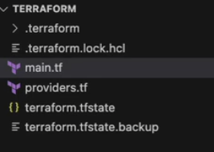
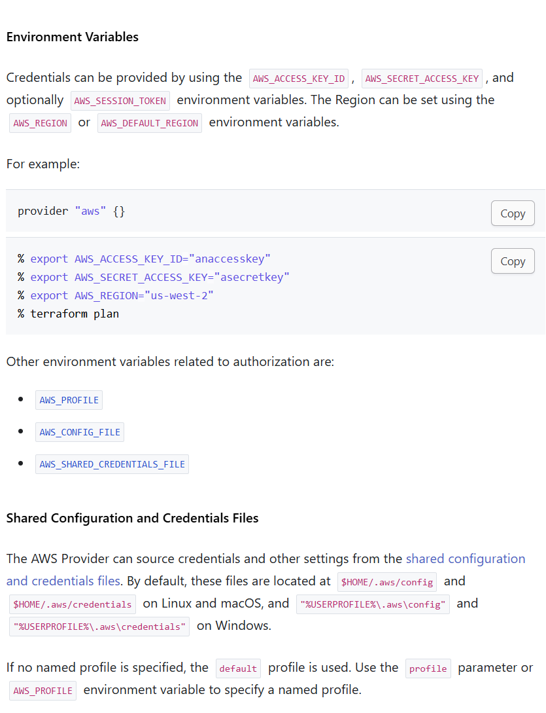

# Terraform

Terraform是一个基础设施即代码工具(Iac)，它允许你定义基础设施的配置文件，然后使用这些配置文件来创建、更新和删除基础设施。Terraform配置文件使用HCL（HashiCorp Configuration Language）编写，它是一种易于阅读和编写的配置语言。terraform是一种声明式的配置语言，这意味着你只需要定义你想要的基础设施，而不需要定义如何实现这些基础设施。

## 目录结构

Terraform 有.tf文件和.tfstate文件。.tf文件是配置文件，.tfstate文件是状态文件，用来记录当前基础设施的状态。

同时还有一个.lock.hcl文件，用来记录当前terraform的版本。
还有初始化后生成的.terraform文件夹，用来存放terraform的插件和缓存。



## Syntax

HCL类似于JSON，但是更加人类可读。HCL的基本语法如下：

```json
resource "aws_instance" "example" {
  ami           = "ami-0c55b159cbfafe1f0"
  instance_type = "t2.micro"
}
```

对于不同的平台，需要使用不同的provider，比如AWS，Azure等。在配置文件中，需要指定使用的provider, 同时也兼具身份验证的功能。

```json
provider "aws" {
  region = us-west-1
}
```

在初次使用时需要先初始化terraform，使用`terraform init`命令。初始化完成后，可以使用`terraform plan`命令来查看terraform的执行计划，使用`terraform apply`命令来执行计划。
    - 在`apply`命令后加入`-auto-approve`参数，可以直接执行计划，不需要再次确认。

如果对一个terraform重复执行`terraform apply`命令，terraform会自动检测当前状态和配置文件的差异，然后生成一个执行计划（declarative）

创建资源使用`resource`关键字，资源的类型和名称之间使用空格分隔。资源的属性使用键值对的形式定义。
如果创建资源时需要引用上下文，可以直接使用resource的名称和属性名称.
如果需要查询，则使用`data`关键字.
如果要删除资源，有两种方式：

1. 使用`terraform destroy <resource name>`命令，删除指定的资源。如果不指定资源名称，则删除所有资源。
2. 修改tf文件，把原有的资源段删除，然后使用`terraform apply`命令，terraform会自动删除这个资源。(更推荐，因为tf更直观，他显示的就是应有的状态)

如果要查看资源的状态，可以使用`terraform state show`命令。

如果要输出资源的属性，可以在tf中使用`output`关键字。

```json
output "instance_ip" {
  value = aws_instance.example.public_ip
}
```

### Variables

为了避免硬编码，可以使用变量。变量可以在tf文件中定义，也可以在命令行中传入，或者在`terraform.tfvars`文件中定义，后两种如果有定义，会覆盖tf文件中的定义。

```json
variable "region" {
  type    = string # 也可以是list, 比如list的话，在引用时可以使用[index] 类似python
  default = "us-west-1" # 如果没有，则会在命令行中要求输入
  description = "The region in which to launch the instance"
}

resource "aws_instance" "example" {
  ami           = "ami-0c55b159cbfafe1f0"
  instance_type = "t2.micro"
  region        = var.region
}
```

命令行方式：

```bash
terraform apply -var="region=us-west-1"
```

`terraform.tfvars`文件方式：

```json
#同级目录下 terraform.tfvars
region = "us-west-1"
```

如果为了区分不同变量用了多个tfvars文件，不是默认的`terraform.tfvars`，可以使用`-var-file`参数指定文件。

```bash
terraform apply -var-file="prod.tfvars"
```

同样的，如果想在字符串中引用变量，可以使用`${var.<variable_name>}`的方式。


### Environment variables

可以使用环境变量来传递变量，具体环境变量名查阅官方文档。主要动机还是为了避免硬编码。

```bash
export TF_VAR_region=us-west-1
```
可是这是临时的。如果要永久的，可以在`~/.bashrc`或者`~/.bash_profile`中添加。
或者使用aws cli的profile，这样terraform会自动使用aws cli的profile。

具体举例：



同时 Terraform 也支持自定义环境变量 `TF_VAR_`，比如 `TF_VAR_myregion="us-east-1a`，这样就可以参考上一节的变量定义。

```json
variable "myregion" {
}

resource "aws_instance" "example" {
  ami           = "ami-0c55b159cbfafe1f0"
  instance_type = "t2.micro"
  region        = var.myregion
}
```

