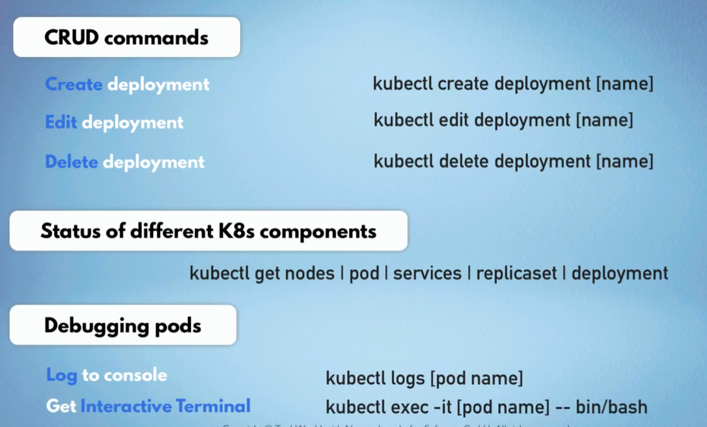
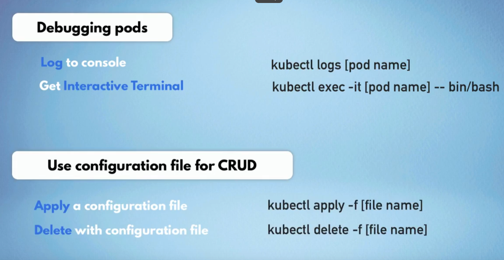

# k8s层级

    - Deployment
      - replicasets
        - Pod（container）

# Kubectl command

在本地部署k8s集群，可以使用minikube，minikube是一个轻量级的k8s集群，可以在本地运行一个单节点的k8s集群，可以用来学习k8s的基本操作，kubectl是k8s的命令行工具，会附带安装。

记得重启后要打开minikube和docker，使用命令`minikube start`，然后使用`minikube status`来查看minikube的状态。




# Yaml file
Yaml file 是用来定义k8s资源(Deployment)的文件，可以通过 `kubectl apply -f filename.yaml` 来创建资源
每个文件可以包含三个部分：
1. metadata : 包含资源的名字，namespace，labels等信息
2. spec : 包含资源的配置信息，比如容器的镜像，端口，环境变量等, 其中定义具体Pod的信息是在template中定义的，template类似于configuration in configuration
3. status : 包含资源的状态信息，由k8s自动填充, 是k8s自愈的基础，它在运行中会被k8s自动更新并且和spec保持一致，如果不一致就会被k8s自动修复。信息来源于k8s的apiserver中的etcd数据库。
   - 个人经历： 部署一个mongodb的时候，其中密码的key在secret文件中拼错了，导致createrror，后来改正了secret文件中的key，重新apply secret文件，mongodb自动检测到secret文件的变化，自动修复了密码的问题。

因为是Yaml文件，所以需要严格遵循Yaml的语法规则，比如缩进，空格等。

## Deployment 和 service的关系

+ 一句话概括：Deployment是Pod的管理器，Service是Pod的访问器
    - 如果Pod挂了，Deployment会自动创建新的Pod
    - 如果你的Pod不需要外部访问，那么就不需要Service

+ 链接方式: 
    - Deployment和Service通过label来关联，Deployment中的selector和Service中的selector是一样的，这样Service就知道要访问哪些Pod了
    - 举例：
  
      ``` yaml
      # Deployment.yaml
      apiVersion: apps/v1
      kind: Deployment
      metadata:
        name: my-app
      spec:
        replicas: 3
        selector:
          matchLabels:
            app: my-app # 这个必须和Service的selector中的标签一致
        template:
          metadata:
            labels:
              app: my-app # 这个必须和Service的selector中的标签一致
          spec:
            containers:
            - name: my-app # 这个是container的名字，无所谓
              image: my-app-image
              ports:
              - containerPort: 80
      ```

      可以看出这个selector中待匹配的标签为 `my-app` 所以服务的selector也应该是 `my-app`

      ``` yaml
      apiVersion: v1
      kind: Service
      metadata:
        name: my-app-service
      spec:
        selector:
          app: my-app # 这个必须和Deployment的selector中的标签一致
        ports:
        - protocol: TCP
          port: 80
          targetPort: 80
        type: ClusterIP
      ```
      需要说明的是这个service是ClusterIP类型的，即“internal service” 它映射的不是本机端口，他只是在node内部，也就是集群内部访问，如果要外部访问，需要使用NodePort或者LoadBalancer类型的Service。

      但是即便是NodePort类型的Service，在minikube里需要额外的使用命令`minikube service my-app-service`来访问，因为minikube是一个虚拟环境，需要手动给他分配一个external ip.