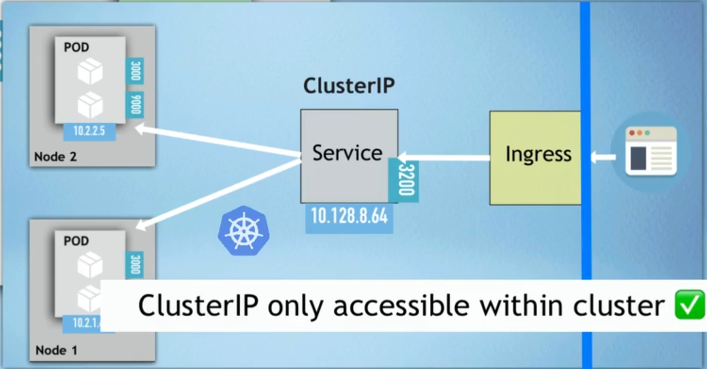
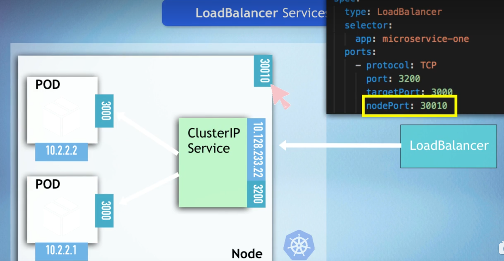
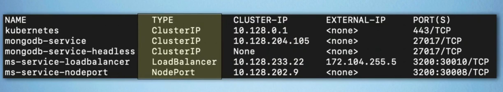
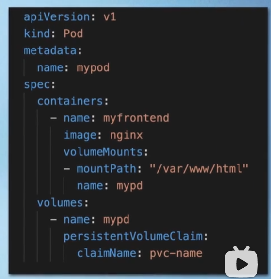
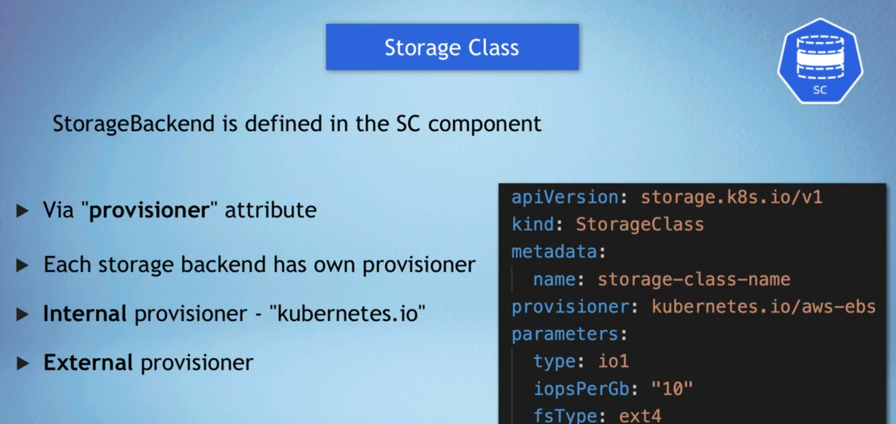

# k8s层级

    - Deployment
      - replicasets
        - Pod（container）

# Kubectl command

在本地部署k8s集群，可以使用minikube，minikube是一个轻量级的k8s集群，可以在本地运行一个单节点的k8s集群，可以用来学习k8s的基本操作，kubectl是k8s的命令行工具，会附带安装。

记得重启后要打开minikube和docker，使用命令`minikube start`，然后使用`minikube status`来查看minikube的状态。


# Yaml file

Yaml file 是用来定义k8s资源(Deployment)的文件，可以通过 `kubectl apply -f filename.yaml` 来创建资源
每个文件可以包含三个部分：

1. metadata : 包含资源的名字，namespace，labels等信息, namespace可以很好的区分同名资源
   - 通常服务可以跨namespace访问，其他的如secret，configmap等资源是最好不要跨namespace访问，同时volume和node是没有namespace的。
2. spec : 包含资源的配置信息，比如容器的镜像，端口，环境变量等, 其中定义具体Pod的信息是在template中定义的，template类似于configuration in configuration
3. status : 包含资源的状态信息，由k8s自动填充, 是k8s自愈的基础，它在运行中会被k8s自动更新并且和spec保持一致，如果不一致就会被k8s自动修复。信息来源于k8s的apiserver中的etcd数据库。
   - 个人经历： 部署一个mongodb的时候，其中密码的key在secret文件中拼错了，导致createrror，后来改正了secret文件中的key，重新apply secret文件，mongodb自动检测到secret文件的变化，自动修复了密码的问题。
   - 个人经历2： 部署完成后如果想要更新系统变量，需要重新部署并且删除上一个pod，因为k8s不会自动更新pod的环境变量，只会在创建时候更新。语法是 `kubectl delete pod -l app=my-app`，这个命令会删除所有label为app=my-app的pod，然后Deployment会自动创建新的pod。

-

因为是Yaml文件，所以需要严格遵循Yaml的语法规则，比如缩进，空格等。

## Deployment 和 service的关系

- 一句话概括：Deployment是Pod的管理器，Service是Pod的访问器
  - 如果Pod挂了，Deployment会自动创建新的Pod
  - 如果你的Pod不需要外部访问，那么就不需要Service

- 链接方式:
  - Deployment和Service通过label来关联，Deployment中的selector和Service中的selector是一样的，这样Service就知道要访问哪些Pod了
  - 举例：
  
  ``` yaml
    # Deployment.yaml
    apiVersion: apps/v1
    kind: Deployment
    metadata:
      name: my-app
    spec:
      replicas: 3
      selector:
        matchLabels:
          app: my-app # 这个必须和Service的selector中的标签一致
      template:
        metadata:
          labels:
            app: my-app # 这个必须和Service的selector中的标签一致
        spec:
          containers:
          - name: my-app # 这个是container的名字，无所谓
            image: my-app-image
            ports:
            - containerPort: 80
  ```

  可以看出这个selector中待匹配的标签为 `my-app` 所以服务的selector也应该是 `my-app`

  ``` yaml
  apiVersion: v1
  kind: Service
  metadata:
    name: my-app-service
  spec:
    selector:
      app: my-app # 这个必须和Deployment的selector中的标签一致
    ports:
    - protocol: TCP
      port: 80
      targetPort: 80
    type: ClusterIP
  ```

      需要说明的是这个service是ClusterIP类型的，即“internal service” 它映射的不是本机端口，他只是在node内部，也就是集群内部访问，如果要外部访问，需要使用NodePort或者LoadBalancer类型的Service。

      但是即便是NodePort类型的Service，在minikube里需要额外的使用命令`minikube service my-app-service`来访问，因为minikube是一个虚拟环境，需要手动给他分配一个external ip.
      但是一般也不会用NodePort，因为NodePort不太安全，通常用LoadBalancer或者Ingress，在minikube中使用ingress同样是tunnel的方式，即配置好ingress后，使用`minikube tunnel`激活ingress，然后就可以通过ingress的ip访问了。
  ### Service的类型

  1. ClusterIP: 默认类型，只能在集群内部访问
  - 匹配方式：通过selector来匹配Pod， targetPort是匹配Pod的端口，也就是where to go，port是Service的端口,也就是where to listen.
  - 多个targetPort: 一个Service可以匹配多个Pod，在service的yaml文件中需要显式的说明port的name和其他信息
  - headless: 通过DNS来访问Pod，service本身不会有ClusterIP，然后返回的是Pod的ClusterIP。 通常用于statefulset，如数据库。
  - 设置方式：在service的yaml文件中设置 `clusterIP: None`
  

  2. NodePort: 通过node的端口来访问Pod，可以在集群外部访问
  - 匹配方式：通过selector来匹配Pod， targetPort是匹配Pod的端口，也就是where to go，port是Service的端口,也就是where to listen. nodePort是node的端口，也就是where to access，他的范围是30000-32767。port和nodeport是映射关系,见下图loadbalancer.
  - 通过 `minikube service my-app-service` 来访问
  - nodeport不太安全，通常用于测试，现实中常用LoadBalancer或者Ingress
  
  3. LoadBalancer: 通过云服务商的负载均衡器来访问Pod，可以在集群外部访问
     - 比nodeport更合适，因为入口是负载均衡器，可以做一些安全控制，并不是client直接访问nodeport。
   

   总结：

   
## Ingress

Ingress是k8s的一个资源，用来管理外部访问，他是一个集群内的HTTP和HTTPS路由器，可以根据域名和路径来转发请求到不同的Service上，Ingress是一个集群内的资源，所以需要一个Ingress Controller来处理Ingress资源，Ingress Controller是一个独立的Pod，他会监听Ingress资源的变化，然后根据Ingress资源的配置来配置负载均衡器，Ingress Controller可以是Nginx，Traefik，HAProxy等。

minikube中可以使用`minikube addons enable ingress`来启用ingress。

默认Ingress Controller是Nginx，可以通过`kubectl get pods -n kube-system`来查看。

## Volume

Volume是k8s的一个资源，用来存储数据，他是一个抽象的概念，可以映射到物理存储，也可以映射到内存，他可以被Pod使用，Volume的生命周期和Pod的生命周期是一样的，当Pod被删除时，Volume也会被删除。
在使用Volume的时候，需要在Pod的yaml文件中的volumes里定义，并且有一个persistentVolumeClaim(  PVC)，用来请求Volume，这个volumeclaim有点像service,同样用独立的yaml文件来定义。
最后才是在container的yaml文件中的volumeMounts里定义，用来挂载Volume。


- secret configmap也是volume的一种，是local volume，不需要pvc，他们可以被yaml文件/k8s资源ref。也可以生成文件加载到container中。
  - secret 还有一种是imagePullSecrets，用来pull私有仓库的镜像。以docker为例, 生成secret的命令是 `kubectl create secret docker-registry my-secret --docker-server=DOCKER_REGISTRY_SERVER --docker-username=DOCKER_USER --docker-password=DOCKER_PASSWORD`，然后在pod的yaml文件中的imagePullSecrets中引用这个secret。缺点是只能对应一个私有仓库，如果有多个私有仓库，需要多个secret。

其他类型： 

动态生成Volume： 也就是事先没有分配好具体的物理地址，pvc申请时才分配，一般是云存储。



## StatefulSet

Statefulset同样是k8s的一个资源，用来管理有状态的应用，比如数据库，他和Deployment很像，但是有一些不同：

- statefulset做replicate比deployment要复杂，因为有状态的应用需要保证数据的一致性，所以statefulset会给每个pod分配一个唯一的id (sticky identity)，这个id会在pod重启时保持不变，这样就可以保证数据的一致性。
- 对于deployment来说，他的pod是无状态的，可以随便删除，重启，每个pod是完全相同和互换的，但是statefulset有一个main pod其他的是replica pod，main pod会先启动，然后再启动replica pod，这样就可以保证数据的一致性。

## Helm

Helm是k8s的包管理器，本质是一个k8s的资源打包工具，他可以把k8s的资源打包成一个chart，然后通过helm来安装，卸载，更新chart，helm的chart是一个目录，里面包含了k8s的资源文件，还有一个values.yaml文件，用来配置k8s资源的参数，这样就可以很方便的部署k8s资源了。