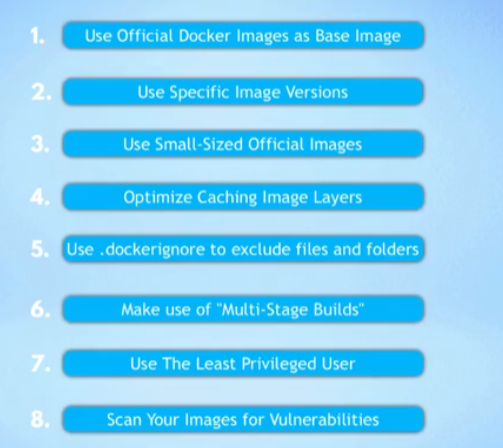

# 概念

## Best Practice
FROM nana


## 与虚拟机的不同
一般来说计算机系统可以分为两个部分

1. 应用层
2. 核心层（与硬件通讯）
   
docker是虚拟了应用层，没有自己的OS kernel。而虚拟机是虚拟化了一整个操作系统，包括了核心层。所以这也解释了docker的image是分操作系统的，一般来说在Linux build的 image不适用于在windows上，因为Linux 的application layer无法调用Windows 的os kernel。
但是！Docker desktop 却支持在windows上运行Linux image，其实是因为内部集成了一个轻量级的Linux的发行版，导致了可以让linux 的image可以在windows电脑上运行。

## 安装Docker Desktop到底安装了什么

1. Docker Engine
   核心，server，管理容器和image
2. Docker CLI-Client
   命令行interface，可以和docker server交互
3. GUI Client
   图像化界面与docker server交互

## Docker images是什么，和container有什么关系
1. images是一种可运行的应用artifact，一种集合就像zip文件一样打包了所有需要的东西，比如完整的环境配置信息，任何需要的服务
2. Container是一个运行image实例的地方，可以一个image在不同容器中同时运行
3. Docker Hub 是推荐的docker Registries 可以下载官方或者个人开发者开发的image，同时也是Docker Desktop的默认下载位置


## 数据库
  ### 常见数据库类型
  1. 关系型数据库 relational database
     - 优点
        1. 数据一致性
        2. 数据完整性
        3. 数据安全性
     - 缺点
        1. 读写性能差
        2. 扩展性差
        3. 一致性维护困难
     - 例子
        1. MySQL
        2. PostgreSQL
   2.  键值对数据库 key-value database
       - 优点
         1. 读写性能好
         2. 扩展性好
       - 缺点
         1. 数据一致性差
         2. 数据完整性差
       - 例子
         1. Redis
         2. Memcached
   3. 列存储数据库 column-oriented database
        - 优点
          1. 读写性能好
          2. 扩展性好
        - 缺点
          1. 数据一致性差
          2. 数据完整性差
        - 例子
          1. HBase
          2. Cassandra
   4.  文档型数据库 document-oriented database
        - 优点
          1. 读写性能好
          2. 扩展性好
        - 缺点
          1. 数据一致性差
          2. 数据完整性差
        - 例子
          1. MongoDB
          2. CouchDB
   5.  图数据库 graph database
        - 优点
          1. 读写性能好
          2. 扩展性好
        - 缺点
          1. 数据一致性差
          2. 数据完整性差
        - 例子
          1. Neo4j
          2. ArangoDB
   6.  搜索数据库 search database
        - 优点
          1. 读写性能好
          2. 扩展性好
        - 缺点
          1. 数据一致性差
          2. 数据完整性差
        - 例子
          1. ElasticSearch
          2. Solr

## volume
   volume是一个目录或者文件，可以在container和host之间共享数据

   有三种类型的volume：

  1. host volume
  2. anonymous volume
  3. named volume （最常用）
   
  docker desktop中可以在setting中设置volume的位置，但是他妈的这是host volume，所以它没法通过 name reference来引用，只能通过绝对路径来引用，如果想把它变成named volume，可以通过docker volume create命令来创建一个named volume，然后在一个container挂载两个volume，一个是host volume，一个是named volume,然后把host volume的数据copy到named volume中，然后删除host volume，这样就可以通过name reference来引用了。
  
  代码:

  ``` shell
  docker volume create my-vol

  docker run --rm -v /path/to/host/volume:/source -v my-vol:/dest busybox sh -c "cd /source && tar cf - . | (cd /dest && tar xvf -)"

  ```

