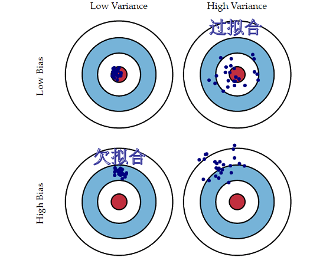

## 一些基本概念

### 判别式模型和生成式模型
- 判别式模型：直接对条件概率P(Y|X)建模，例如逻辑回归、SVM、决策树、KNN等。
- 生成式模型：对联合概率P(X,Y)建模，然后通过贝叶斯公式计算条件概率P(Y|X)，例如朴素贝叶斯、隐马尔科夫模型、高斯混合模型等。
- 两者的异同：最终都是对条件概率的计算，判别式更直观好想。生成式模型会有多个模型，给定X后，选择概率最大的Y。判别式模型只有一个模型，直接给出Y。

### 过拟合和欠拟合
- 过拟合：模型在训练集上表现很好，但在测试集上表现很差。模型过于复杂，学习到了训练集的噪声。
- 欠拟合：模型在训练集和测试集上表现都很差。模型过于简单，无法学习到数据的规律。
- 使用bias和variance：过拟合时，模型的bias很小，variance很大（误差波动大）。欠拟合时，模型的bias很大，variance很小。如果两个都大那找个模型错的离谱，也算是欠拟合(自我感觉)。

    

过拟合解决办法：增加数据量、减少特征量、正则化、交叉验证等。也可以用集成学习方法，如bagging等。
欠拟合解决办法：增加特征量、增加模型复杂度、减少正则化等。也可以用集成学习方法，如boosting等。